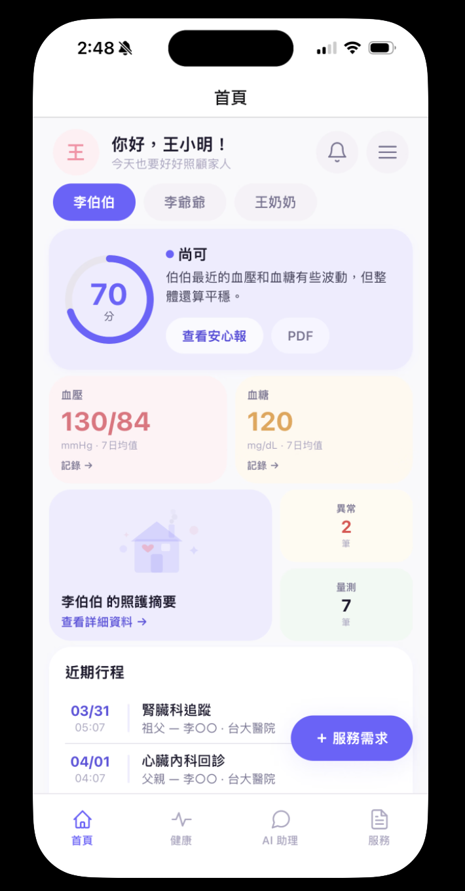
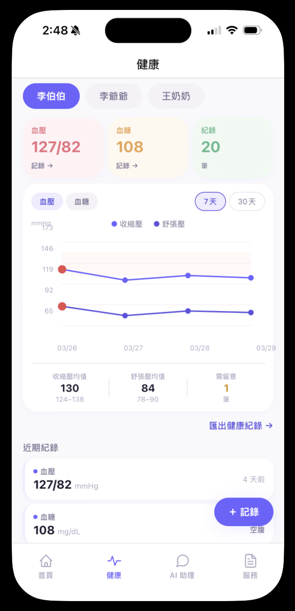
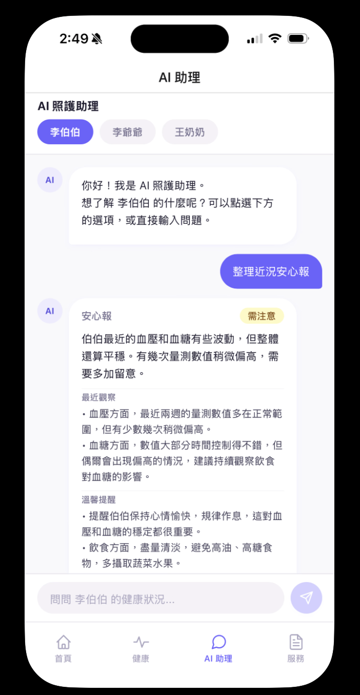
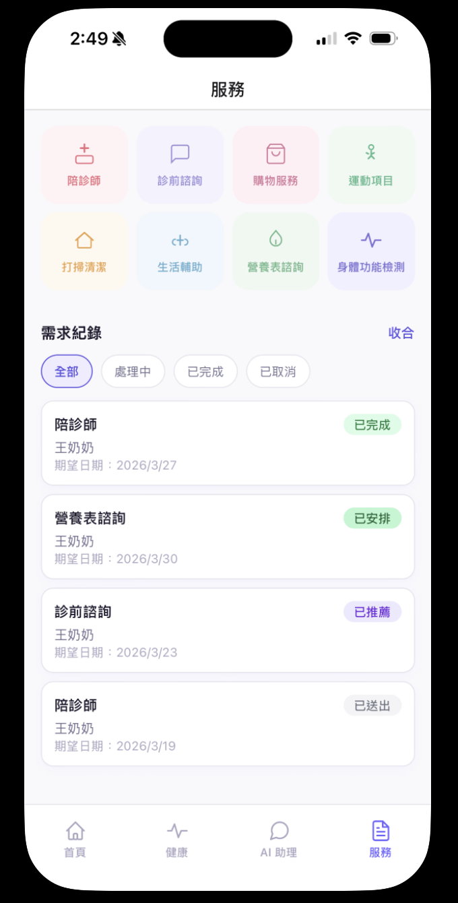
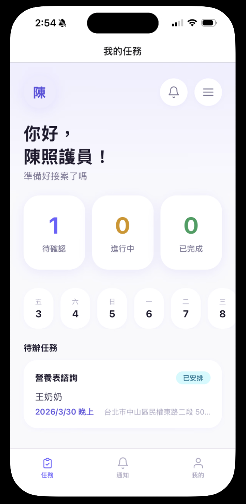
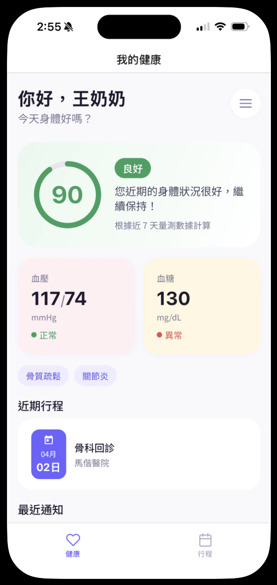
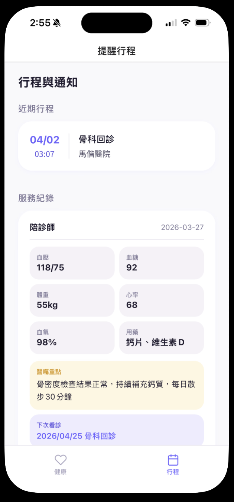
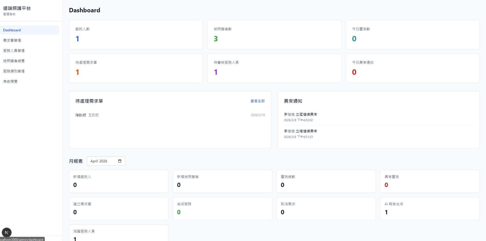
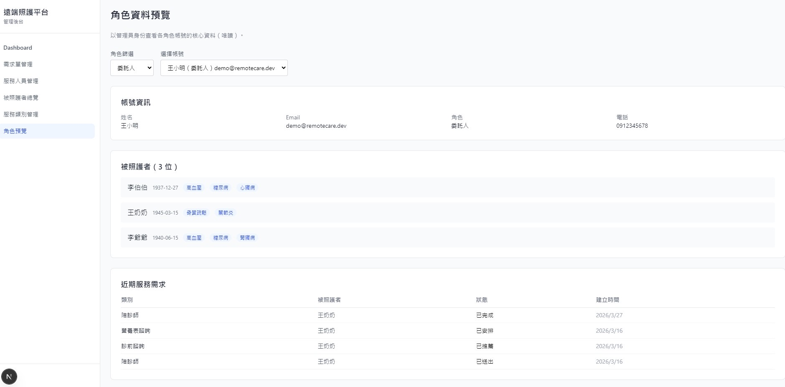

# Remote Care Platform


A production-grade, full-stack remote health monitoring and care coordination platform. Built as a TypeScript monorepo spanning a Next.js REST API, an Expo React Native mobile app, and a shared contract layer — four distinct user roles, one unified backend.

---

## Table of Contents

- [Motivation](#motivation)
- [Screenshots](#screenshots)
- [Architecture](#architecture)
- [Tech Stack](#tech-stack)
- [Key Features](#key-features)
- [Project Structure](#project-structure)
- [API Surface](#api-surface)
- [Data Model](#data-model)
- [Engineering Decisions](#engineering-decisions)
- [Roadmap](#roadmap)
- [Getting Started](#getting-started)
- [Environment Variables](#environment-variables)
- [Testing](#testing)
- [CI/CD](#cicd)

---

## Motivation

I'm a Taiwanese student studying in Sydney, and my parents and grandparents are still back in Taiwan. Distance makes it hard to stay on top of their health — blood pressure readings get forgotten, medication timing is inconsistent, and coordinating a care visit means a dozen phone calls across time zones.

I built this platform to solve that problem directly. The entire user interface is in Traditional Chinese (繁體中文) because that is the language my family speaks, the language elderly care recipients in Taiwan are comfortable with, and the language that caregivers in that market will actually use day-to-day. Localisation is not cosmetic — it is the product.

Beyond the personal use case, the project is a full end-to-end technical demonstration built solo: a 46-endpoint REST API, a cross-platform mobile app with four role-segmented interfaces, a web admin back-office, AI integration with safety guardrails, and a CI pipeline enforcing zero lint warnings and strict TypeScript across all three workspaces.

---

## Screenshots

> **Note on language:** All user-facing text is in Traditional Chinese (繁體中文). The platform targets elderly care in Taiwan — caregivers and care recipients in that market are most comfortable in Chinese, and using any other language would create friction for the very people the product is designed to help. Code, comments, API contracts, and this README are all in English.

---

### Mobile App — Caregiver (家屬)

The caregiver is the primary user — typically an adult child managing the health of one or more elderly parents. The interface supports switching between multiple care recipients, each with independent health records, AI reports, and service requests.

<table>
  <tr>
    <td align="center"><b>Home Dashboard</b></td>
    <td align="center"><b>Health Trends</b></td>
    <td align="center"><b>AI Assistant</b></td>
    <td align="center"><b>Care Services</b></td>
  </tr>
  <tr>
    <td valign="top"></td>
    <td valign="top"></td>
    <td valign="top"></td>
    <td valign="top"></td>
  </tr>
  <tr>
    <td valign="top">
      The home screen shows a computed health score (0–100) for the selected care recipient, the latest blood pressure and glucose readings with 7-day averages, upcoming medical appointments, and a shortcut to submit a new care service request. The pill-shaped buttons at the top switch between multiple recipients under this caregiver's account.
    </td>
    <td valign="top">
      The health tab renders a dual-line SVG chart (systolic and diastolic pressure) with an anomaly highlight zone. Red dots mark individual readings that exceeded the threshold. Below the chart: average, min/max range, and a count of flagged readings over the selected 7- or 30-day window. All thresholds are read from a shared constants file — never hardcoded.
    </td>
    <td valign="top">
      The AI assistant is a conversational interface backed by GPT-4o-mini. The caregiver taps a quick-action chip ("Generate health summary") or types a free-form question about the recipient's recent data. The AI response is structured JSON validated by Zod — status label (needs attention, shown in amber), a plain-language summary, recent observations, and warm-toned suggestions. Medication names and diagnoses are explicitly prohibited in the system prompt.
    </td>
    <td valign="top">
      The services tab shows 8 care categories as a tappable grid — escorted medical visits, pre-visit consultation, grocery shopping, exercise programmes, home cleaning, daily living support, nutritional consultation, and physical assessment. Below the grid, the request history list shows each submission's current status. The four status badges visible here (completed, arranged, recommended, submitted) represent four different stages of the 9-state matching workflow.
    </td>
  </tr>
</table>

---

### Mobile App — Care Provider (服務人員) & Care Recipient (被照護者)

Two additional roles with purpose-built interfaces on the same platform — same login screen, different tab set after authentication.

<table>
  <tr>
    <td align="center"><b>Provider — Task Dashboard</b></td>
    <td align="center"><b>Care Recipient — Health Summary</b></td>
    <td align="center"><b>Care Recipient — Schedule & Records</b></td>
  </tr>
  <tr>
    <td valign="top"></td>
    <td valign="top"></td>
    <td valign="top"></td>
  </tr>
  <tr>
    <td valign="top">
      The provider role sees a completely different interface after login — three tabs instead of four, no health data, no service request submission. The dashboard shows a summary of pending confirmations (1), active jobs (0), and completed cases (0), with a weekly date strip and a list of assigned tasks below. Each task card shows the service type, the care recipient's name, the expected date and time slot, and the service address. This interface is only accessible to users whose JWT contains <code>role: "provider"</code>.
    </td>
    <td valign="top">
      The care recipient (an elderly person in the family) logs in to a simplified read-only interface with only two tabs. This screen shows their own health score (90 — "Good"), the latest blood pressure reading marked normal (green dot), the latest blood glucose reading flagged as abnormal (red dot), their medical condition tags ("osteoporosis", "arthritis"), and the next upcoming appointment. There are no input controls, no forms, and no write operations available to this role anywhere in the app.
    </td>
    <td valign="top">
      The schedule tab for the care recipient shows upcoming appointments and a log of completed service visits. The service record card here includes structured health metrics collected during the visit (blood pressure, glucose, weight, heart rate, blood oxygen, current medications), the doctor's instructions from that visit, and the date of the next follow-up appointment. This data is entered by the caregiver or admin and is visible to the care recipient as a read-only health journal.
    </td>
  </tr>
</table>

---

### Web Admin Dashboard

The operator back-office is a server-rendered Next.js application accessible at `/admin`. Admins manage the full service matching lifecycle, review and approve care providers, and monitor platform health — all through a separate web interface that shares the same REST API as the mobile app.

<table>
  <tr>
    <td align="center"><b>Platform Dashboard</b></td>
    <td align="center"><b>Role Data Preview</b></td>
  </tr>
  <tr>
    <td valign="top"></td>
    <td valign="top"></td>
  </tr>
  <tr>
    <td valign="top">
      The dashboard aggregates live platform stats across the top row: total caregivers (1), care recipients (3), measurements recorded today (0), pending service requests (1), providers awaiting approval (1), and anomaly alerts triggered today (0). Below that, two live feed panels: the left shows recent unhandled service requests (here: an escorted medical visit request for "Wang Grandma"), and the right shows the anomaly notification feed (two consecutive blood pressure and glucose alerts for the same recipient, both fired within seconds of each other — demonstrating the deduplication logic by type). The bottom section is a monthly report with per-metric aggregates including the count of AI reports generated.
    </td>
    <td valign="top">
      The role preview page allows an admin to select any role and any account to inspect their data — a read-only support tool. Here the admin has selected the caregiver role and the demo account "Wang Xiaoming". The panel shows account info (name, email, role, phone), a list of 3 care recipients under this caregiver's account (each with a birth date and coloured medical condition tags), and a table of recent service requests with their current statuses. This gives operators full visibility for support and mediation without needing direct database access.
    </td>
  </tr>
</table>

---

## Architecture

```
┌──────────────────────────────────────────────────────┐
│                     Client Layer                      │
│   ┌─────────────────┐       ┌──────────────────────┐  │
│   │  Expo React     │       │  Next.js Web Admin   │  │
│   │  Native (mobile)│       │  /admin/*            │  │
│   │  caregiver /    │       │  operator dashboard  │  │
│   │  patient /      │       │                      │  │
│   │  provider       │       │                      │  │
│   └────────┬────────┘       └──────────┬───────────┘  │
│            │ HTTPS (Bearer JWT)        │ HTTPS (Cookie)│
└────────────┼──────────────────────────┼───────────────┘
             │                          │
┌────────────▼──────────────────────────▼───────────────┐
│              Next.js API Layer  /api/v1/*              │
│  ┌──────────┐ ┌──────────┐ ┌───────────┐ ┌─────────┐ │
│  │   Auth   │ │  RBAC +  │ │ AI Service│ │  Rate   │ │
│  │Middleware│ │ Ownership│ │(OpenAI)   │ │ Limiter │ │
│  └──────────┘ └──────────┘ └───────────┘ └─────────┘ │
│  ┌──────────┐ ┌──────────┐ ┌───────────┐             │
│  │   Zod    │ │  Prisma  │ │   CSRF    │             │
│  │Validation│ │  Client  │ │  Guard    │             │
│  └──────────┘ └──────────┘ └───────────┘             │
└────────────────────────┬──────────────────────────────┘
                         │
┌────────────────────────▼──────────────────────────────┐
│                      Data Layer                        │
│  ┌──────────────┐  ┌────────────┐  ┌───────────────┐  │
│  │  PostgreSQL  │  │Cloudflare  │  │   OpenAI API  │  │
│  │  (Supabase)  │  │  R2 / S3  │  │  GPT-4o-mini  │  │
│  └──────────────┘  └────────────┘  └───────────────┘  │
└───────────────────────────────────────────────────────┘
```

The same 46 REST endpoints serve both the mobile app (`Authorization: Bearer <jwt>`) and the web admin UI (`httpOnly` cookie). The auth middleware resolves the token source transparently — no duplicate API surface.

Four roles share a single login entry point. After authentication, the JWT `role` claim drives tab visibility on mobile and route guards on the web, with ownership checks enforced server-side on every resource access.

---

## Tech Stack

### Backend (`apps/web`)
| Concern | Choice |
|---------|--------|
| Framework | Next.js 15 (App Router, Route Handlers) |
| Language | TypeScript 5.7 (`strict`, `noUncheckedIndexedAccess`) |
| ORM | Prisma 6 |
| Database | PostgreSQL 15 via Supabase (pgBouncer connection pooling) |
| Auth | JWT HS256, 7-day expiry — Bearer header + httpOnly cookie |
| Validation | Zod 3 — shared schemas, single source of truth |
| AI | OpenAI SDK — GPT-4o-mini, JSON output mode, Zod-validated |
| Rate Limiting | Upstash Redis (`@upstash/ratelimit`) — serverless-safe |
| File Storage | Cloudflare R2 via pre-signed PUT/GET URLs |
| Testing | Vitest |

### Mobile (`apps/mobile`)
| Concern | Choice |
|---------|--------|
| Framework | Expo 54 / React Native 0.81 |
| Navigation | expo-router 6 — file-based, role-segmented tab visibility |
| Auth Storage | `expo-secure-store` (hardware-backed encryption) |
| Typography | Noto Sans TC — Traditional Chinese, preloaded |
| Charts | Custom SVG `TrendChart` — dual-line BP, anomaly highlighting |
| Sharing | `expo-sharing`, `expo-clipboard`, `expo-print` |
| Testing | Jest + jest-expo |

### Shared (`packages/shared`)
| Concern | Choice |
|---------|--------|
| Schemas | Zod — 9 schema files, consumed by API handlers and mobile forms |
| Build | tsup — dual CJS + ESM output with `.d.ts` declarations |
| Testing | Vitest |

### Infrastructure & DX
| Concern | Choice |
|---------|--------|
| Monorepo | Turborepo + pnpm workspaces |
| CI | GitHub Actions — lint, typecheck, test in parallel; build gated on all three |
| Deployment | Vercel (web + API), Expo EAS (mobile) |
| Linting | ESLint `--max-warnings 0` across all workspaces |

---

## Key Features

### Health Monitoring
- Record blood pressure (systolic, diastolic, heart rate) and blood glucose (fasting / before meal / after meal / random)
- Configurable morning/evening measurement reminders per care recipient
- Automatic anomaly detection using rule-based thresholds — values sourced from `shared/constants/thresholds.ts`, never hardcoded in handlers
- Consecutive anomaly alerts: triggers when ≥2 of the last 3 same-type readings are abnormal; 24-hour deduplication prevents notification spam
- 7-day and 30-day trend statistics: min/max/avg/anomaly count/daily aggregates
- Exportable plain-text health summaries for sharing via LINE, WhatsApp, or email

### AI Health Reports

Four report types powered by GPT-4o-mini with strict JSON output mode and Zod schema validation on the response:

| Type | Output structure |
|------|-----------------|
| `health_summary` | Status label (`stable` / `attention` / `consult_doctor`) + conclusion + reasons + suggestions |
| `trend_analysis` | Trend direction + plain-language explanation + key observations |
| `visit_prep` | Categorised doctor questions + items to bring to the appointment |
| `family_update` | Warm-tone narrative update for sharing with family members |

Every AI call has: one automatic retry, a typed static fallback on failure, rate limiting (3 reports/hour/recipient, 10 chats/hour/user), and a mandatory non-dismissible disclaimer in the UI. System prompts explicitly prohibit medication names, diagnoses, and emergency medical advice.

### Care Service Matching

Caregivers submit requests across 8 fixed service categories. Requests traverse a 9-state machine enforced by a single `VALID_STATUS_TRANSITIONS` map in `packages/shared`:

```
submitted → screening → candidate_proposed → caregiver_confirmed
                                          → provider_confirmed → arranged → in_service → completed
         └──────────────────────── cancelled (any non-terminal state) ───────────────────────────┘
```

The two-way confirmation sub-flow (`candidate_proposed → caregiver_confirmed + provider_confirmed → arranged`) ensures both caregiver and provider explicitly commit before a case is locked in. Admin proposes candidates filtered to only `approved` + `available` providers.

### Role-Based Access Control

Every API endpoint enforces a four-layer security model in order:

1. **JWT authentication** — Bearer header (mobile) or httpOnly cookie (web admin)
2. **CSRF origin check** — all mutation methods validated against an allowed-origins whitelist
3. **Role whitelist** — explicit `ALLOWED_ROLES` constant at the top of every handler
4. **Ownership verification** — `recipient.caregiver_id`, `recipient.patient_user_id`, `assigned_provider_id` checked server-side

`patient` and `provider` tokens cannot access other users' data even with a valid JWT — ownership is verified against the database on every request, not inferred from the token.

### Web Admin Dashboard
- Real-time platform stats: caregivers, recipients, daily measurements, pending requests, anomaly alerts
- Service request management with state transition controls — only legally-valid next states are shown
- Provider lifecycle: create profiles, upload certification documents (pre-signed R2 flow), review/approve/suspend, set service level (L1/L2/L3)
- Monthly report aggregates: new users, measurements, AI reports generated, services completed
- Role data preview: inspect any account's recipients, medical tags, and service history

---

## Project Structure

```
remote-care/
├── apps/
│   ├── mobile/                  # Expo React Native
│   │   ├── app/
│   │   │   ├── (auth)/          # login, register
│   │   │   └── (tabs)/          # single navigator, role-gated tab visibility
│   │   │       ├── home/        # caregiver: recipient list + detail + appointments
│   │   │       ├── health/      # caregiver: measurements, trends, AI report, export
│   │   │       ├── ai/          # caregiver: AI assistant chat
│   │   │       ├── services/    # caregiver: requests; provider: tasks
│   │   │       └── patient/     # patient: read-only health summary + schedule
│   │   ├── components/ui/       # Card, StatusPill, TrendChart, Toast, EmptyState, ErrorState
│   │   └── lib/                 # api-client, auth-context, theme tokens
│   │
│   └── web/                     # Next.js 15
│       ├── app/
│       │   ├── api/v1/          # 46 REST route handlers
│       │   └── admin/           # server-rendered admin UI (Tailwind CSS)
│       ├── lib/                 # auth, api-response, csrf, ai, ai-prompts, abnormal-notification
│       └── prisma/              # schema (12 models), migrations, seed
│
├── packages/
│   └── shared/                  # consumed by both apps — never imports from either
│       └── src/
│           ├── schemas/         # 9 Zod schema files
│           ├── constants/       # enums, error-codes, thresholds, status-display
│           └── utils/           # health-score
│
└── .github/workflows/ci.yml     # lint + typecheck + test → build
```

---

## API Surface

46 REST endpoints across 11 domain groups, all under `/api/v1`:

| Group | Endpoints |
|-------|-----------|
| Auth | `POST /auth/register`, `POST /auth/login`, `GET/PUT /auth/me`, `POST /auth/logout`, `POST /auth/admin-login` |
| Recipients | `GET/POST /recipients`, `GET/PUT /recipients/:id`, `GET/PUT /recipients/:id/reminders/:type` |
| Measurements | `GET/POST /measurements`, `GET /measurements/stats`, `GET /measurements/export` |
| AI | `POST /ai/health-report`, `GET /ai/reports`, `POST /ai/chat`, `GET /ai/interactions`, `POST /ai/assistant` |
| Appointments | `GET/POST /appointments`, `GET/PUT/DELETE /appointments/:id` |
| Service Requests | `GET/POST /service-requests`, `GET /:id`, `PUT /:id/status`, `PUT /:id/propose-candidate`, `PUT /:id/confirm-caregiver`, `PUT /:id/confirm-provider`, `PUT /:id/cancel` |
| Service Categories | `GET /service-categories`, `GET/POST/PUT /admin/service-categories/:id` |
| Providers (Admin) | `GET/POST /providers`, `GET/PUT /providers/:id`, `PUT /providers/:id/review` |
| Provider Workspace | `GET/PUT /provider/me`, `GET /provider/tasks`, `GET /provider/tasks/:id`, `PUT /provider/tasks/:id/progress` |
| Admin | `GET /admin/dashboard`, `GET /admin/recipients`, `GET /admin/reports` |
| Notifications | `GET /notifications`, `GET /notifications/unread-count`, `PUT /notifications/:id/read`, `PUT /notifications/read-all` |

All responses use a consistent envelope — success, paginated list, or structured error with a typed error code:

```json
{ "success": true, "data": { ... } }
{ "success": true, "data": [...], "meta": { "page": 1, "limit": 20, "total": 100 } }
{ "success": false, "error": { "code": "RESOURCE_OWNERSHIP_DENIED", "message": "...", "details": [] } }
```

---

## Data Model

12 Prisma models backed by PostgreSQL:

```
users ─────────────── recipients (caregiver 1:N, patient 1:1)
                           │
              ┌────────────┼────────────────┐
              │            │                │
        measurements   ai_reports     appointments
                           │
                      ai_interactions
                           │
                     service_requests ── service_categories
                           │
                        providers ── provider_documents
                           │
                       notifications
                     measurement_reminders
```

**Soft delete** on `recipients` and `providers` (`deleted_at`). **Hard delete** only for `appointments` — user-managed calendar entries with no audit requirement. All timestamps stored as UTC `timestamptz`; timezone conversion happens on the client.

---

## Engineering Decisions

**Shared Zod package as the only contract layer.**
An early alternative was to keep types in each app and sync manually. Instead, both the API server (validation) and mobile client (form validation via `react-hook-form + zod`) import the same schema from `packages/shared`. Adding a field to the schema is one change in one file — the TypeScript compiler then surfaces every callsite that needs updating in both apps simultaneously.

**Single REST API serving both mobile and web admin.**
Server Actions were considered for the admin UI since it's a Next.js app. They were rejected because the mobile client requires REST — using Server Actions for admin would have meant maintaining two separate data access layers. The same 46 endpoints serve both clients; the auth middleware detects whether to read from the Bearer header or the cookie.

**Upstash Redis for rate limiting instead of in-memory.**
Vercel serverless functions are stateless — each request can land on a different instance, so a `Map`-based rate limiter silently fails under real traffic. Upstash provides a Redis REST API that works within the serverless execution model and stays within the free tier for MVP-scale usage.

**AI with typed static fallbacks, not error pages.**
If the OpenAI call fails or returns JSON that fails Zod's `parse`, the user gets a coherent degraded response ("Unable to generate report, please check the trend chart") rather than a 502. Every fallback is a typed constant that satisfies the same schema as a real response, so the rendering code never needs to branch on whether AI succeeded.

**State machine enforced in `packages/shared`, not in handlers.**
`VALID_STATUS_TRANSITIONS` is a `Record<ServiceRequestStatus, ServiceRequestStatus[]>` constant. Every handler that changes a service request status imports and checks it — there is no logic duplicated across the admin status endpoint, the caregiver confirmation endpoint, and the provider confirmation endpoint. Adding a new state transition is one line in one file.

**Zero ESLint warnings as a hard CI gate.**
`--max-warnings 0` means any warning fails the build. This prevents the pattern where warnings accumulate to hundreds over weeks and become too expensive to fix. Each workspace runs its own lint job in parallel; Turborepo caches the result so clean reruns are instant.

---

## Roadmap

The current build is a complete MVP. The architecture intentionally leaves extension points for the following:

| Phase | Feature | Preparation already in place |
|-------|---------|------------------------------|
| Phase 2 | Real hardware device ingestion | `POST /api/v1/device/ingest` endpoint scaffolded; `source: 'device'` field in measurements schema |
| Phase 2 | Blood glucose unit conversion (mmol/L) | `unit` field stored as `varchar`; conversion logic defined in spec; Zod enum extension is a one-line change |
| Phase 2 | Personalised anomaly thresholds | Threshold functions in `shared/constants/thresholds.ts` are pure functions, ready to accept per-recipient overrides |
| Phase 3 | RAG-based AI with long-term health memory | `ai_interactions` model already persists all chat history with recipient context |
| Phase 3 | Payment and provider revenue sharing | `service_requests` schema includes metadata JSON field; no payment logic in MVP by design |

---

## Getting Started

**Prerequisites:** Node.js ≥ 20, pnpm 9

```bash
# Clone and install
git clone <repo-url>
cd remote-care
pnpm install

# Configure environment
cp .env.example apps/web/.env.local
# (edit apps/web/.env.local with your credentials)

# Run migrations and seed demo data
pnpm db:migrate
pnpm db:seed

# Start all apps (Next.js API + Admin UI + Expo)
pnpm dev
```

**Demo accounts (seeded automatically):**

| Role | Email | Password |
|------|-------|----------|
| Caregiver | `demo@remotecare.dev` | `Demo1234!` |
| Care Recipient | `patient.demo@remotecare.dev` | `Patient1234!` |
| Provider | `provider.demo@remotecare.dev` | `Provider1234!` |
| Admin | `admin@remotecare.dev` | `Admin1234!` |

Web admin: `http://localhost:3000/admin`
Mobile: scan the QR code printed by `pnpm dev` in Expo Go

---

## Environment Variables

```bash
# apps/web/.env.local

# Database — use pooled URL at runtime, direct URL for migrations only
DATABASE_URL=postgresql://...?pgbouncer=true&connection_limit=1
DIRECT_URL=postgresql://...

# Auth
JWT_SECRET=your-secret-here

# AI
OPENAI_API_KEY=sk-...
OPENAI_MODEL=gpt-4o-mini        # optional, defaults to gpt-4o-mini

# Rate Limiting (Upstash Redis)
UPSTASH_REDIS_REST_URL=https://...
UPSTASH_REDIS_REST_TOKEN=...

# CORS / CSRF origin whitelist
NEXT_PUBLIC_APP_URL=http://localhost:3000

# File Storage (Cloudflare R2)
R2_ACCOUNT_ID=...
R2_ACCESS_KEY_ID=...
R2_SECRET_ACCESS_KEY=...
R2_BUCKET_NAME=...
R2_PUBLIC_URL=...

# Device ingestion token (Phase 2 placeholder)
DEVICE_API_TOKEN=dev-device-token-12345
```

---

## Testing

```bash
pnpm test               # all workspaces
cd apps/web && pnpm test:watch   # watch mode
```

| Package | Test files | What's covered |
|---------|-----------|----------------|
| `packages/shared` | 9 | Zod schema validation, threshold functions, error codes, `VALID_STATUS_TRANSITIONS` |
| `apps/web` | 13 | Every API route handler — happy path + auth failure + ownership denial + invalid state transitions |
| `apps/mobile` | 1 | App smoke test |

API tests use Vitest with mocked Prisma and OpenAI clients. Each handler test covers: unauthenticated access, wrong role, ownership violation, validation failure, and success path.

---

## CI/CD

GitHub Actions — lint, typecheck, and test run in parallel; build only runs when all three pass:

```
push / pull_request → main
         │
    ┌────┴────────────┐
    ▼    ▼            ▼
  lint  typecheck   test
    │       │         │
    └───────┴─────────┘
                │
             build
```

- ESLint across all workspaces with `--max-warnings 0`
- `tsc --noEmit` across all workspaces (Turborepo caches unchanged packages)
- Vitest (web + shared) + Jest (mobile)
- `turbo build` in dependency order — `shared` compiles before `web` and `mobile`
- Concurrent runs on the same branch are cancelled automatically
